# ECS Project — Production-Grade Container Deployment

A Go web application deployed to AWS ECS Fargate, accessible over HTTPS via a custom domain. Built with Terraform, automated with GitHub Actions, and secured with ACM.

**Live URL:** https://tm.ismaaeelahmed.co.uk *(demo — infrastructure destroyed after submission to avoid AWS charges)*

---

## Architecture


---

## Overview

- **App:** Go web server with `/health` returning `{"status":"ok"}`
- **Container:** Multi-stage Dockerfile producing a 4.42MB scratch-based image
- **Registry:** Amazon ECR with scan-on-push
- **Compute:** ECS Fargate (0.25 vCPU, 512MB)
- **Networking:** Custom VPC, 2 public subnets across 2 AZs, Internet Gateway
- **Load Balancing:** Application Load Balancer with HTTP → HTTPS redirect
- **SSL:** ACM certificate for `tm.ismaaeelahmed.co.uk`
- **DNS:** Cloudflare CNAME pointing to the ALB
- **IaC:** Terraform with 7 modules + S3 remote state with native locking
- **CI/CD:** GitHub Actions with OIDC authentication (no static keys)

---

## Project Structure

```
ecs-project/
├── app/
│   ├── main.go
│   └── go.mod
├── terraform/
│   ├── main.tf
│   ├── variables.tf
│   ├── outputs.tf
│   ├── provider.tf
│   ├── backend.tf
│   └── modules/
│       ├── vpc/
│       ├── ecr/
│       ├── security-groups/
│       ├── iam/
│       ├── acm/
│       ├── alb/
│       ├── ecs/
│       └── oidc/
├── screenshots/
├── Dockerfile
├── .dockerignore
├── .gitignore
└── README.md
```

---

## Local Setup

### Prerequisites
- Docker
- Go 1.23+
- Terraform 1.11+
- AWS CLI configured

### Run the app locally

```bash
cd app
go run main.go
```

Visit `http://localhost:8080/health` → `{"status":"ok"}`

### Build and run the container

```bash
docker build -t ecs-project:v1 .
docker run -p 8080:80 ecs-project:v1
```

Visit `http://localhost:8080/health`

---

## Terraform Deployment

```bash
cd terraform
terraform init
terraform plan
terraform apply
```

Outputs:
- `alb_dns_name` — the ALB endpoint
- `ecr_repository_url` — where images are pushed

---

## CI/CD Pipelines

| Pipeline | Trigger | What it does |
|----------|---------|-------------|
| ECS App Build & Push | Push to `main` changing `app/` or `Dockerfile` | Builds Docker image, tags with SHA, pushes to ECR |
| ECS Terraform Plan | Pull request changing `terraform/` | Runs `fmt`, `init`, `validate`, `plan` |
| ECS Terraform Apply | Push to `main` changing `terraform/` | Runs `init`, `apply`, health check |
| ECS Terraform Destroy | Manual trigger | Destroys all infrastructure |

All pipelines use **OIDC** — no static AWS keys.

---

## Screenshots

### Local Development
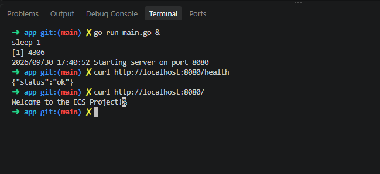
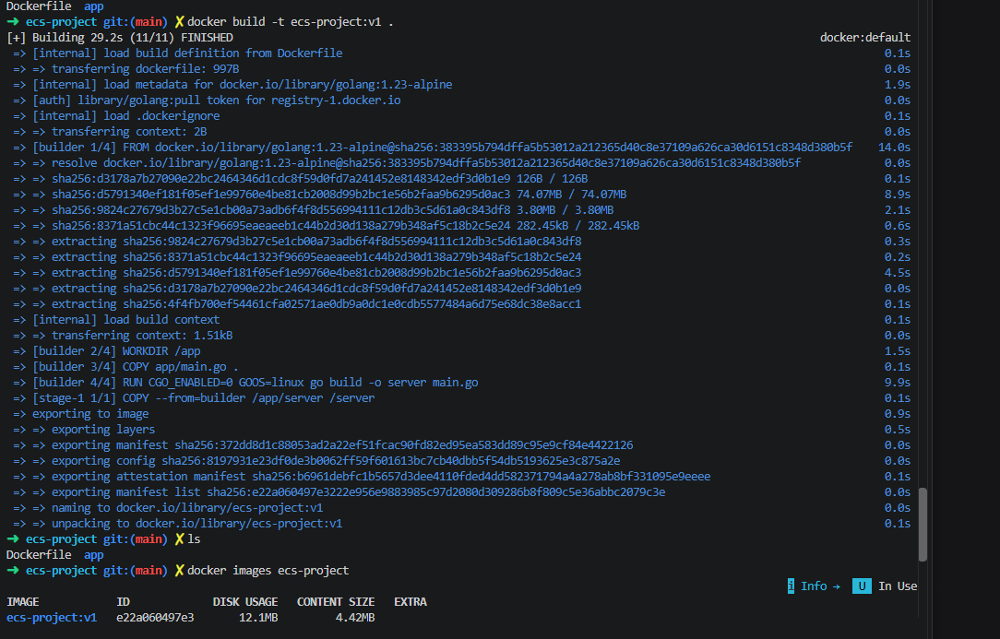


### ClickOps Setup (Before Terraform)
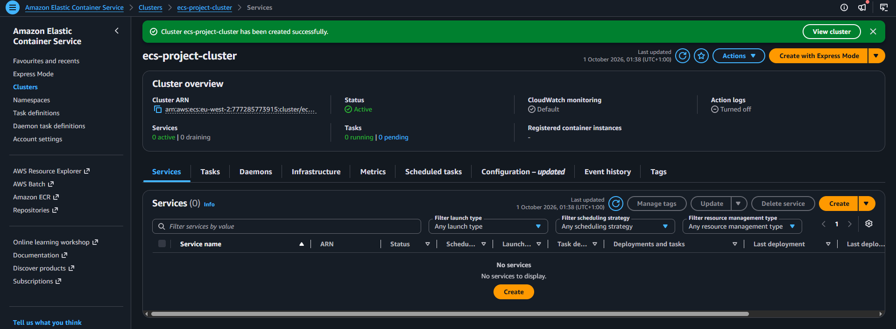
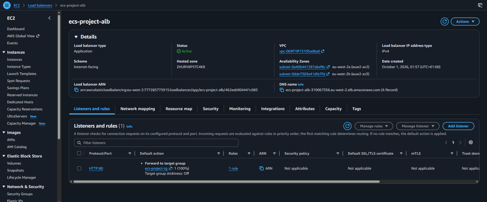
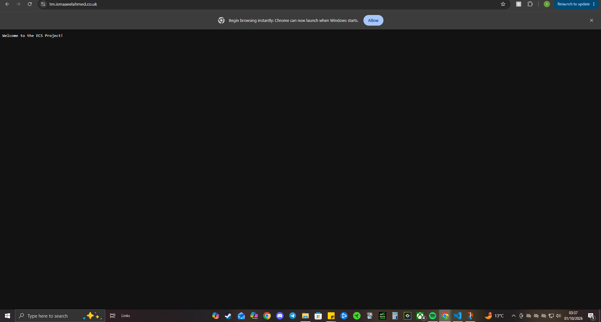

### Terraform
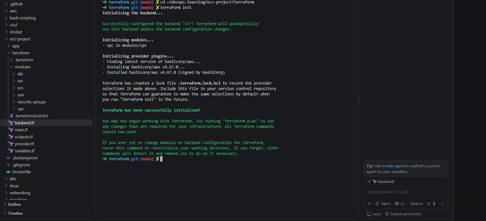
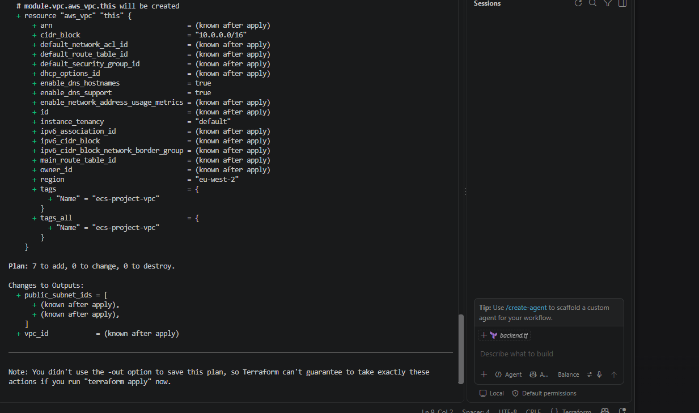
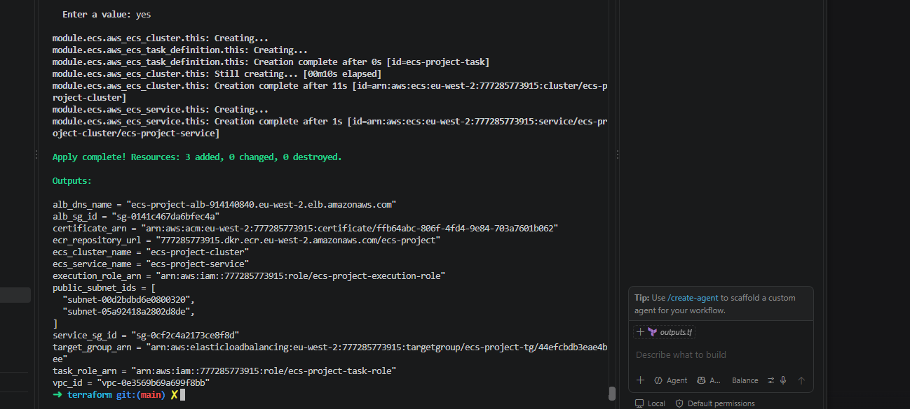
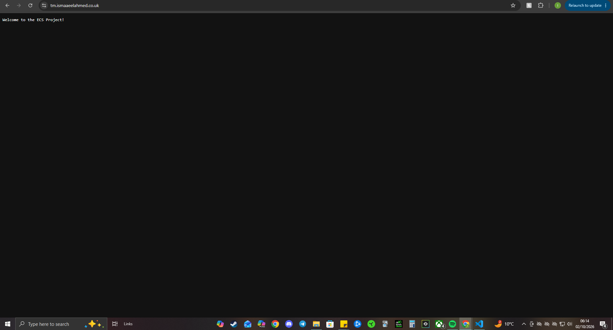

### CI/CD Pipelines
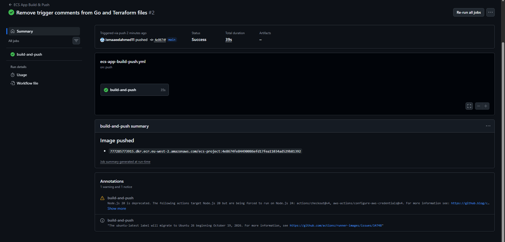
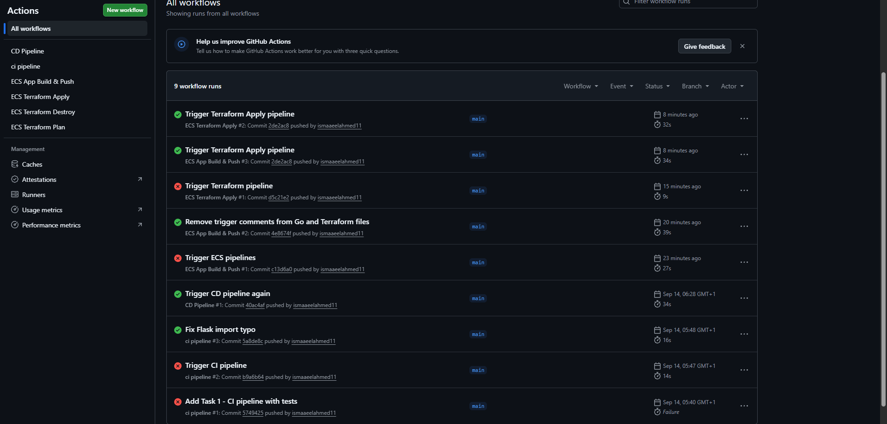
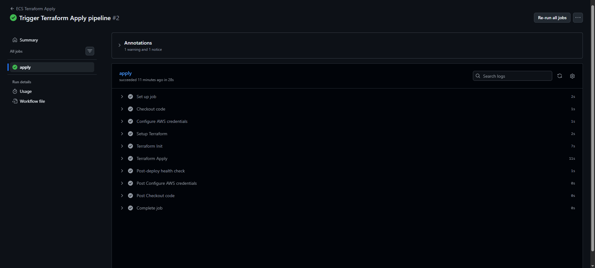

### Architecture
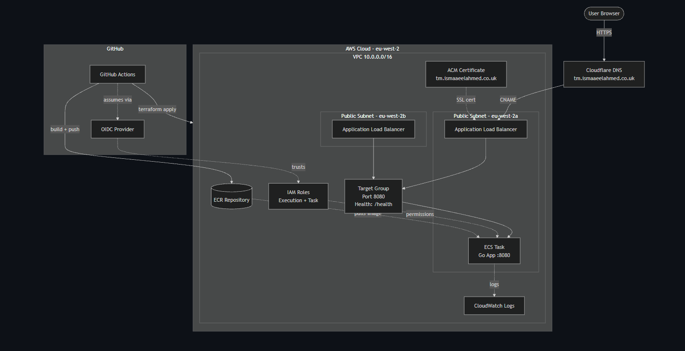

---

## What I Learnt

- ClickOps first, then IaC — understanding the pieces before automating
- Multi-stage Docker builds and scratch images
- Terraform modules for reusability
- Remote state with S3 native locking
- OIDC for secure CI/CD without static keys
- Debugging IAM permissions, port conflicts, and health checks

---

## Troubleshooting Journey

**Issue 1: Container exited with code 1**
Port 80 requires root. Fixed by running the Go app on 8080 and updating the target group, security group, and task definition.

**Issue 2: ECS task couldn't create CloudWatch log group**
The execution role lacked `logs:CreateLogGroup`. Added an inline policy.

**Issue 3: GitHub Actions didn't trigger**
Workflows were in `ecs-project/.github/workflows/`. GitHub only reads from the repo root.

**Issue 4: `use_lockfile` unsupported**
Terraform version in CI was 1.9.0. Bumped to 1.11.0.

---

*Built with Go, Docker, Terraform, and GitHub Actions.*